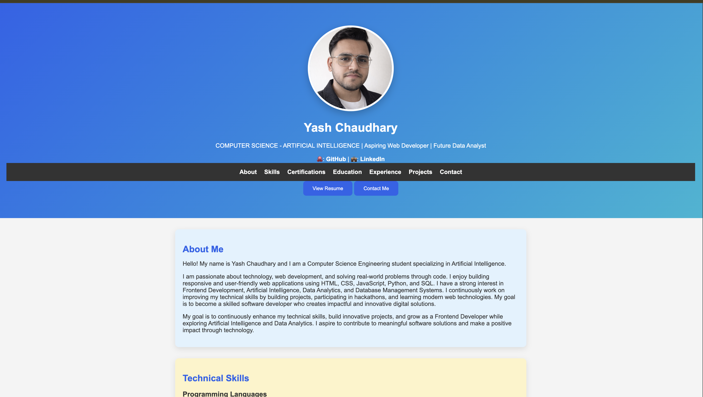

# 🌐 Yash Chaudhary - Personal Portfolio

Welcome to my personal portfolio website! This portfolio showcases my skills, projects, certifications, education, and experience as an aspiring Frontend Developer and AI enthusiast.

## 🚀 Live Website

- 🌍 Netlify: https://yashhchaudharyportfolio.netlify.app
- 🌍 GitHub Pages: https://debugwithyash.github.io/portfolio/

---

## 📌 Features

- 👨‍💻 Professional Portfolio Website
- 📱 Responsive Design
- 📌 Sticky Navigation Bar
- ✨ Smooth Scrolling
- 📄 Resume Download
- 🎓 Education & Certifications
- 💼 Experience & Achievements
- 🚀 Projects Showcase
- 📞 Contact Section
- 🎨 Modern UI with Hover Effects

---

## 🛠️ Technologies Used

- HTML5
- CSS3
- Git
- GitHub
- Netlify

---

## 📂 Featured Projects

- ⭐ CareerOS AI
- 📊 Student Success Dashboard
- 💰 Expense Tracker
- 🤖 AI & Robotics Workshop Landing Page
- 📋 Student Internship Tracker
- 🧺 Laundry Mart Website
- 🌐 Personal Portfolio Website

---

## 📷 Preview

> *(Replace `portfolio-preview.png` with a screenshot of your homepage after adding it to the repository.)*

---

## 📞 Contact

**Yash Chaudhary**

📧 Email: debug.yash05@gmail.com

💼 LinkedIn: https://www.linkedin.com/in/yash-chaudhary-325814329/

🐙 GitHub: https://github.com/debugwithyash

---

## ⭐ Support

If you like this project, don't forget to ⭐ star the repository.

---

### © 2026 Yash Chaudhary
Designed & Developed with ❤️ using HTML & CSS.
